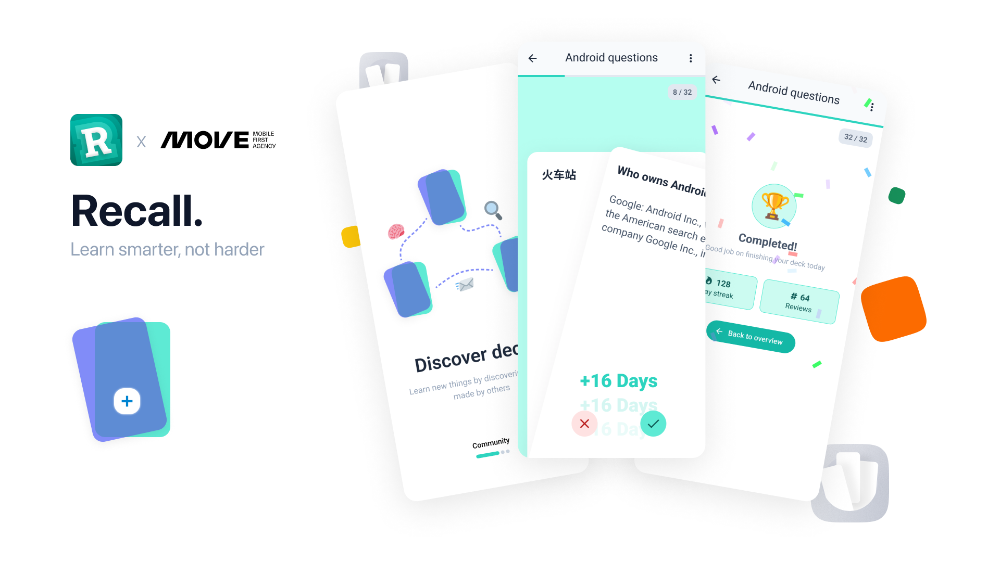
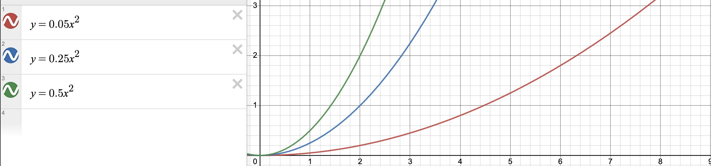
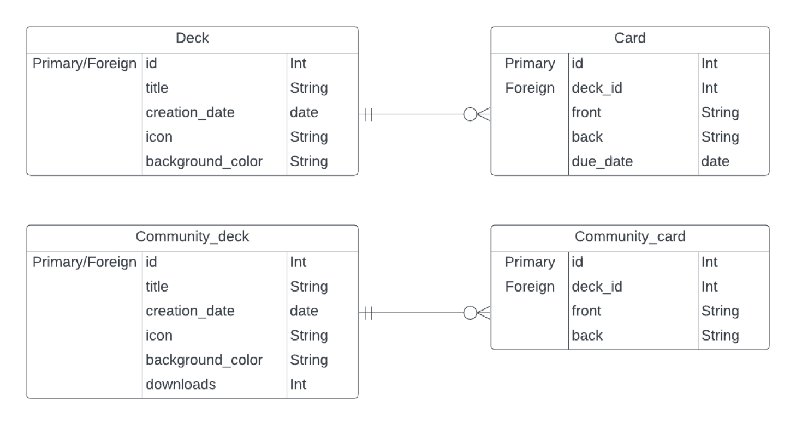

# Recall

Recall is an app that allows you to learn words through flashcards. You create a deck of cards, each with a front and a back. On the front, you write the word, and then you try to recall the definition in your head. Once you have done that, you flip the card over and judge for yourself whether you got the answer right or not. If you got it right, you won't see that card again for a while because you have already memorized it. If you got it wrong, you'll see the card again soon and you'll have to try to recall the correct definition again.

## Deck Sharing

In Recall, there will also be an option to share decks with your friends and classmates. You can create a link and share it with your friends. When a friend opens the link, they will receive a copy of the deck in their own collection of decks. They can then modify the copy, add their own cards, and of course learn from it.

## Technologies/Architecture

To build the app, we're using Jetpack Compose as the framework for building the screens. For the front-end logic, we're using Kotlin. In the back-end, we're using Spring Boot and the programming language is Kotlin. As for the architecture, we're using CLEAN, which is becoming increasingly popular for apps because it's easy to test your code and others can easily read it, making it easy to work with more people on the same project. As the design system, we're using Google's open-source Material 3 Design.

## Clean Architecture

In the project we make use of CLEAN architecture. all files are divided in 4 modules: App, Presentation, Domain and Data.

The App layer consists of the UI of the app. There is almost no logic and the app only uses the Presentation layer to get data. the App layer can access the models in the Domain layer

The Presentation layer passes data to the App layer and handles its logic. It holds all the logic used in the UI and gets data from the Domain layer. It has connections to the App and Domain layer.

The Domain layer holds all the class models that are used in the UI. The Domain layer sends data to the Presentation layer and requests data from the Data layer.

The Data layer requests data from a room database or an API. it receives requests for data from the Domain layer. For each object you can receive from an API there is a separate Data layer model. which we then map to the Domain layer models which can then be used in the UI. The Data layer only has a connection to the Domain Layer

## Smart Learning Algorithm

To facilitate the learning of flashcards, we employ an algorithm. Each card in a deck has a streak associated with it. This streak increases by +1 when you answer a card correctly. If you answer a card incorrectly, the streak is reset to 0. The previous streak doesn't affect the outcome. Based on the current streak, we calculate when you will encounter the card again as you progress through the deck. Three formulas are used for this calculation, and you can choose which formula to use in the app settings:

-   Easy: $y = 0.05x^2$
-   Normal: $y = 0.2x^2$
-   Hard: $y = 0.5x^2$

Here, x represents the streak you currently have, and y denotes the number of days until the next encounter with the card. The y value is always rounded up. For instance, if you are using the Normal formula and your streak is 10 on July 3rd, the next time you will see the card will be on July 23rd. Therefore, it will be 20 days later. 

## Entity Relationship Diagram

